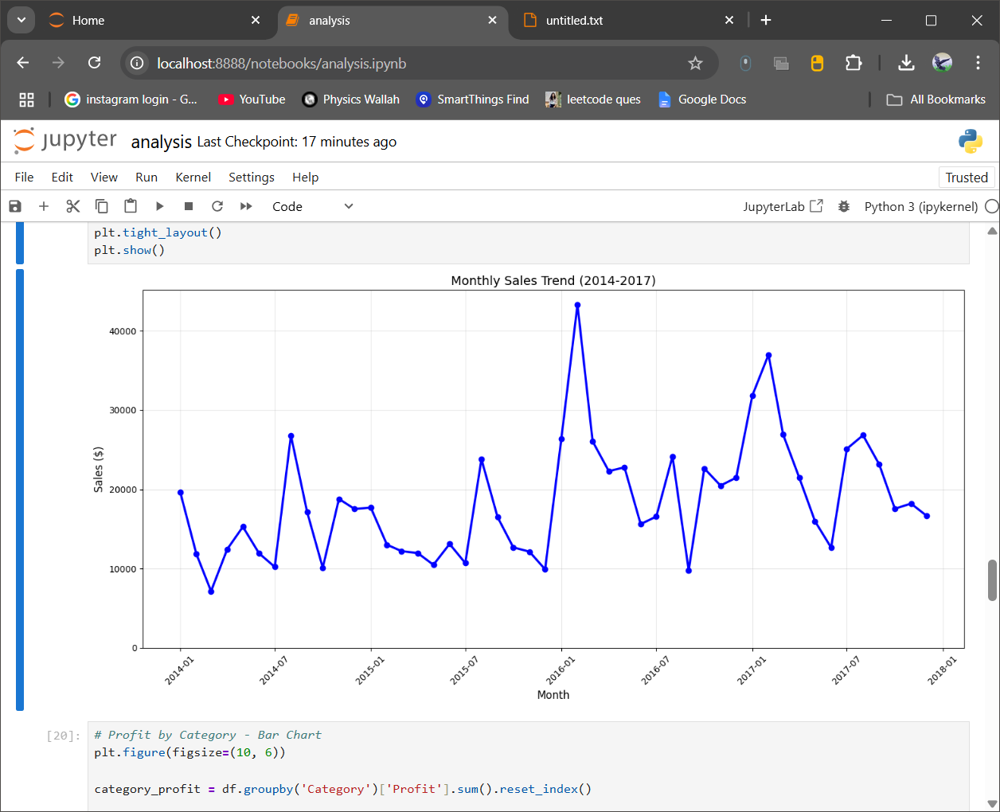
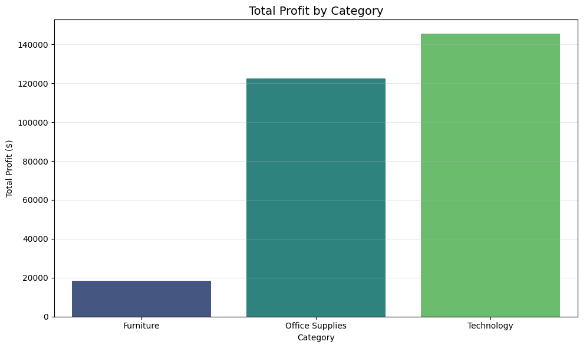
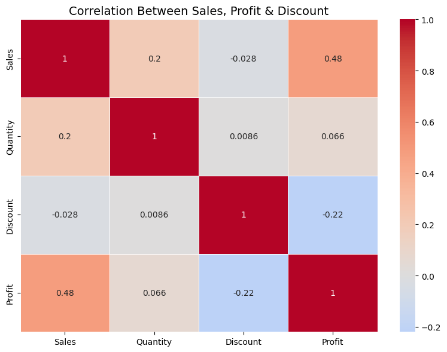
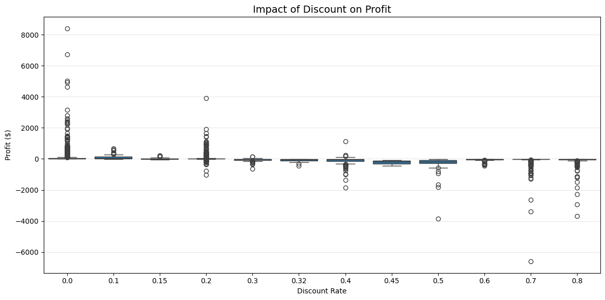

# Retail Sales Analysis (Python + SQL)

## Overview
Exploratory Data Analysis on Sample Superstore dataset to understand sales, profit, and business insights.

## Tools & Technologies
- Python (Pandas, NumPy, Matplotlib, Seaborn)
- SQLite (sqlite3)
- Jupyter Notebook
## Data Cleaning
- Checked for missing values
- Verified duplicate records and removed them if present
- Converted Order Date and Ship Date to datetime format
- Loaded cleaned data into a SQLite database for SQL analysis
## Key Insights

### West region leads in sales but Central has the lowest margins.
**Recommendation:** Investigate Central's cost and discount structure before increasing marketing spend.

### Technology is highly profitable while Furniture suffers due to heavy discounts.
**Recommendation:** Limit Furniture discounts and invest more in Technology promotions.

### High discounts (>30%) frequently result in losses.
**Recommendation:** Keep discounts below 20–25% whenever possible.

### Strong seasonal demand appears during Q4.
**Recommendation:** Increase inventory and staffing before Q4 and use promotions during slower months.

## How to Run
1. Clone/download the repository
2. Place `Superstore sales dataset.csv` in `data/` folder
3. Run `python -m jupyter notebook`
4. Open `analysis.ipynb`
### Open in Google Colab
https://colab.research.google.com/github/KomalVerma90/Retail-Sales-Analysis/blob/main/analysis.ipynb

## Visualizations

